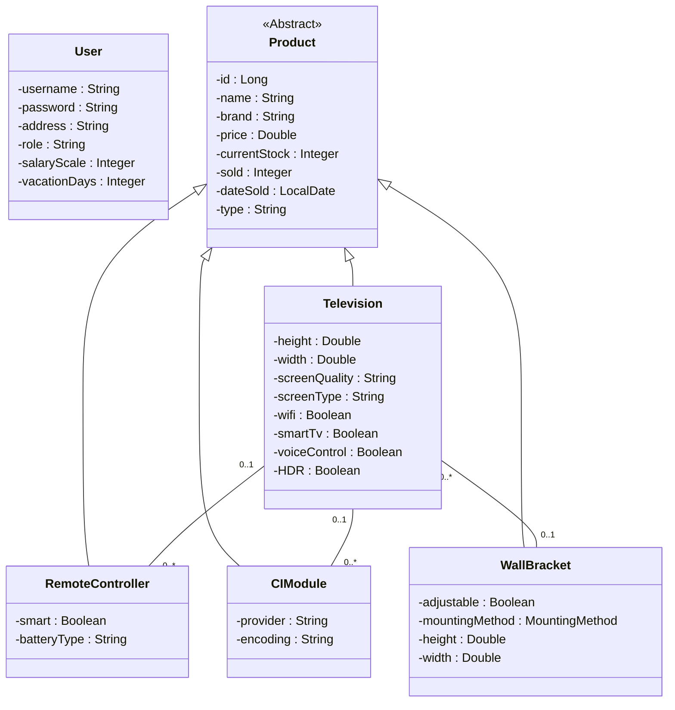

# Inventory Management System

## Overview
This application is designed for effective inventory and order management, focusing on various user roles such as administrators, sales managers, warehouse managers, employees, and customers. The system offers role-based access control to streamline operations, manage inventory levels, track product compatibility, generate sales reports, and facilitate warehouse management.

## Functional Requirements
- **Inventory Management**: View and manage current stock levels per product.
- **Product CRUD Actions**: Users can add, update, and delete products.
- **Pricing Management**: Administrators can adjust purchase and sales prices.
- **Warehouse Tracking**: Track the locations of items within the warehouse.
- **Product Compatibility**: Sales representatives can link compatible accessories and modules to products (e.g., pairing a remote controller with a television).
- **Role-Based Access Control**: Access rights are managed based on user roles (e.g., full access for managers, limited access for employees).
- **Accessory Management**: Assign accessories such as remote controllers, CI modules, and wall brackets to televisions.
- **Sales Tracking**: Track quantities sold per product category.
- **Category Management**: Manage different product categories such as televisions, remote controllers, CI modules, and wall brackets.
- **User Management**: Store and manage user information, including employees' roles and permissions.
- **Sales Reporting**: Generate detailed reports based on sales and inventory data.
- **Incoming Inventory**: View and manage orders of incoming stock.
- **Accessory Compatibility**: Store data about compatible accessories for each product type.
- **Action Logging**: Log actions such as additions, updates, or deletions made by users.

## Non-Functional Requirements
- **User-Friendly Interface**: Simple and intuitive user interface for all user roles.
- **Data Security**: Advanced security for data storage and controlled access.
- **Performance Optimization**: Support for at least 30 simultaneous users without performance degradation.
- **Device Compatibility**: Accessible on both desktops and tablets.
- **High Availability**: Minimal downtime to ensure continuity of business processes.
- **Scalability**: Designed for future expansion of product categories and functionalities.
- **Responsive Design**: Suitable for various screen sizes and devices.

## Class Structure

The following class diagram provides a detailed overview of the system's class structure:

### Explanation

- **Inheritance**: The `Product` class is abstract and is inherited by specific product categories such as `Television`, `RemoteController`, `CIModule`, and `WallBracket`.
- **Associations**:
  - A `Television` can have one or multiple `RemoteControllers` and `CIModules`.
  - A `Television` can be mounted with a `WallBracket`, with an optional one-to-one relationship.
- **User Management**: The `User` class manages data for different user roles, such as warehouse staff and sales managers.
