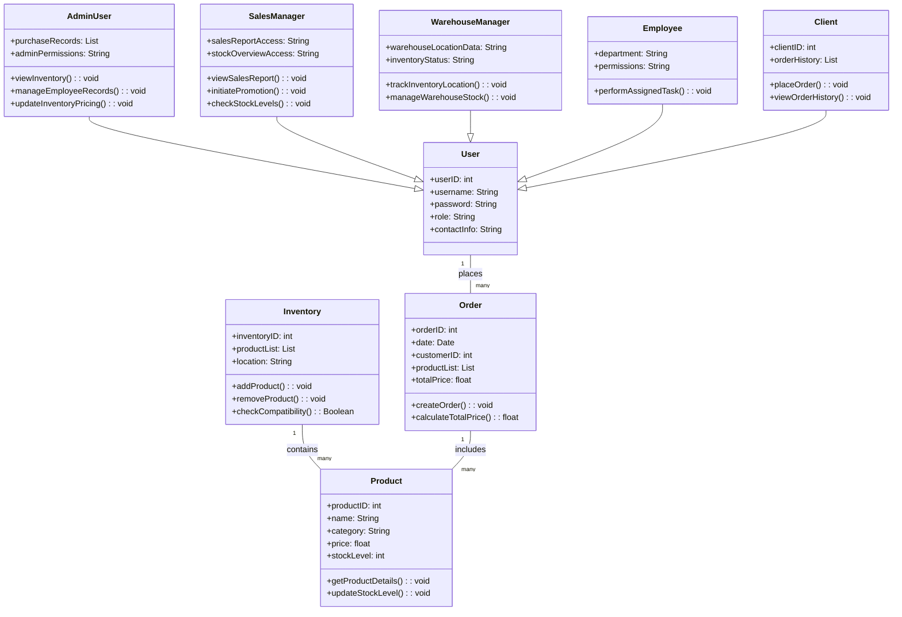

# Inventory Management System

## Overview
This application is designed for effective inventory and order management, catering to various user roles such as administrators, sales managers, warehouse managers, employees, and future clients. The system allows role-based access to streamline operations, manage stock levels, track product compatibility, generate sales reports, and facilitate warehouse management.

## Functional Requirements
- **Stock Management**: View current stock levels per product.
- **Product CRUD Operations**: Users can add, update, and delete products.
- **Pricing Control**: Admins can modify purchasing and sales prices.
- **Warehouse Tracking**: Item locations are tracked in the warehouse.
- **Product Compatibility**: Sales staff can view compatible products.
- **Role-Based Permissions**: Access control is granted based on roles (e.g., full access for managers, limited for employees).
- **Accessory Assignment**: Compatible accessories can be assigned to products (e.g., remote to TV).
- **Sales Tracking**: Track quantities sold per product type.
- **Category Management**: Handle categories such as TVs, remotes, mounts, and CI-modules.
- **Employee Details**: Store and display employee information, roles, and permissions.
- **Sales Reporting**: Generate reports from available sales data.
- **Warehouse Management**: Track stock and product placement.
- **Incoming Stock**: View pending orders for incoming stock.
- **Accessory Compatibility**: Record data on compatible accessories per product.
- **Action Logging**: Display actions like additions or changes by user role.

## Non-Functional Requirements
- **User-Friendly Interface**: Simple and intuitive for all users.
- **Data Security**: Secure data storage and controlled access.
- **Performance Optimization**: Support up to 30 concurrent users.
- **Device Compatibility**: Accessible on desktops and tablets.
- **High Availability**: Ensure minimal downtime for business continuity.
- **Scalability**: Allow for future growth in product types and features.
- **Responsive Design**: Adaptable across various screen sizes.

## Class Structure

The following class diagram provides a detailed view of the system’s class structure:

### Explanation

- **Inheritance**: Specific user roles (`AdminUser`, `SalesManager`, `WarehouseManager`, `Employee`, `Client`) inherit from the `User` base class.
- **Associations**:
  - `User` has a one-to-many relationship with `Order` as users can place multiple orders.
  - `Inventory` holds a collection of `Product` items.
  - `Order` includes multiple `Product` items for each transaction.
