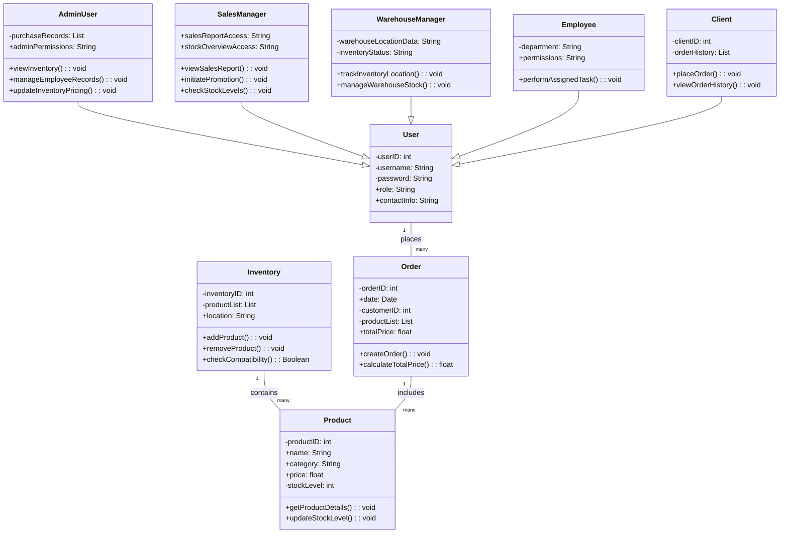

# Voorraad Beheersysteem

## Overzicht
Deze applicatie is ontworpen voor effectief voorraad- en orderbeheer, gericht op verschillende gebruikersrollen zoals beheerders, verkoopmanagers, magazijnbeheerders, medewerkers en toekomstige klanten. Het systeem maakt rolgebaseerde toegang mogelijk om de operaties te stroomlijnen, voorraadniveaus te beheren, productcompatibiliteit te volgen, verkooprapporten te genereren en magazijnbeheer te vergemakkelijken.

## Functionele Eisen
- **Voorraadbeheer**: Huidige voorraadniveaus per product bekijken.
- **Product CRUD Acties**: Gebruikers kunnen producten toevoegen, bijwerken en verwijderen.
- **Prijscontrole**: Beheerders kunnen inkoop- en verkoopprijzen aanpassen.
- **Magazijn Tracking**: Locaties van artikelen worden in het magazijn gevolgd.
- **Productcompatibiliteit**: Verkoopmedewerkers kunnen compatibele producten zien.
- **Rolgebaseerde Permissies**: Toegangscontrole wordt verleend op basis van rollen (bijv. volledige toegang voor managers, beperkte toegang voor medewerkers).
- **Accessoire Toewijzing**: Compatibele accessoires kunnen aan producten worden toegewezen (bijv. afstandsbediening aan tv).
- **Verkooptracking**: Verkochte hoeveelheden per producttype bijhouden.
- **Categoriebeheer**: Beheer van categorieën zoals tv's, afstandsbedieningen, muurbeugels en CI-modules.
- **Medewerkergegevens**: Opslaan en weergeven van medewerkerinformatie, rollen en rechten.
- **Verkooprapportage**: Rapporten genereren op basis van beschikbare verkoopgegevens.
- **Magazijnbeheer**: Voorraad en productplaatsing volgen.
- **Binnenkomende Voorraad**: Inkomende voorraad bekijken (bestellingen in afwachting).
- **Compatibiliteit van Accessoires**: Gegevens opslaan over compatibele accessoires per product.
- **Actielogging**: Acties zoals toevoegingen of wijzigingen per gebruikersrol weergeven.

## Niet-Functionele Eisen
- **Gebruiksvriendelijke Interface**: Eenvoudig en intuïtief voor alle gebruikers.
- **Gegevensbeveiliging**: Veilige opslag van gegevens en gecontroleerde toegang.
- **Prestatieoptimalisatie**: Ondersteuning voor maximaal 30 gelijktijdige gebruikers.
- **Apparaatcompatibiliteit**: Toegankelijk op desktops en tablets.
- **Hoge Beschikbaarheid**: Zorg voor minimale downtime voor bedrijfscontinuïteit.
- **Schaalbaarheid**: Toestaan van toekomstige groei in producttypes en functies.
- **Responsief Ontwerp**: Aanpasbaar voor verschillende schermformaten.

## Klassenstructuur

De volgende klassendiagram geeft een gedetailleerd overzicht van de klassenstructuur van het systeem:

### Verklaring

- **Erfenis**: Specifieke gebruikersrollen (`AdminUser`, `SalesManager`, `WarehouseManager`, `Employee`, `Client`) erven van de basis klasse `User`.
- **Associaties**:
  - `User` heeft een één-op-veel relatie met `Order` omdat gebruikers meerdere bestellingen kunnen plaatsen.
  - `Inventory` bevat een verzameling `Product` items.
  - `Order` omvat meerdere `Product` items voor elke transactie.
