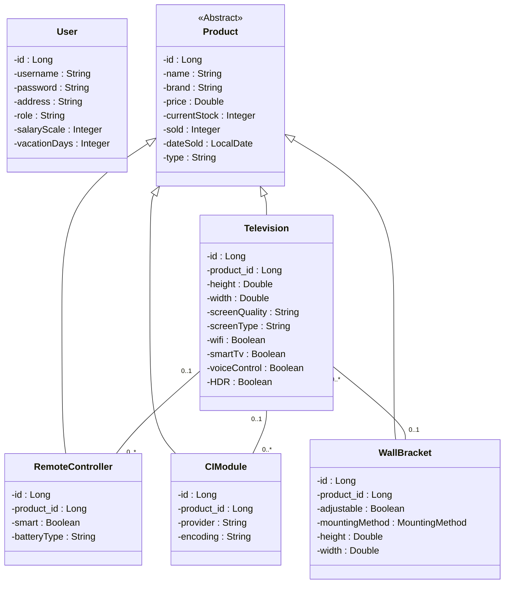

# Voorraad Beheersysteem

## Overzicht
Deze applicatie is ontworpen voor effectief voorraad- en orderbeheer, gericht op verschillende gebruikersrollen zoals beheerders, verkoopmanagers, magazijnbeheerders, medewerkers en klanten. Het systeem biedt rolgebaseerde toegangscontrole om operationele processen te stroomlijnen, voorraadniveaus te beheren, compatibele producten te koppelen, verkooprapporten te genereren en magazijnbeheer te vereenvoudigen.

## Functionele Eisen
- **Voorraadbeheer**: Bekijk en beheer de huidige voorraadniveaus per product.
- **Product CRUD Acties**: Gebruikers kunnen producten toevoegen, bijwerken en verwijderen.
- **Prijsbeheer**: Beheerders kunnen inkoop- en verkoopprijzen aanpassen.
- **Magazijn Tracking**: Houd locaties van artikelen bij binnen het magazijn.
- **Productcompatibiliteit**: Verkoopmedewerkers kunnen compatibele accessoires en modules aan producten koppelen (bijv. afstandsbediening bij een televisie).
- **Rolgebaseerde Toegangscontrole**: Toegangsrechten worden beheerd op basis van gebruikersrollen (bijv. volledige toegang voor managers, beperkte toegang voor medewerkers).
- **Accessoirebeheer**: Wijs accessoires zoals afstandsbedieningen, CI-modules en muurbeugels toe aan televisies.
- **Verkoopregistratie**: Bijhouden van verkochte hoeveelheden per productcategorie.
- **Categoriebeheer**: Beheer verschillende productcategorieën zoals televisies, afstandsbedieningen, CI-modules en muurbeugels.
- **Gebruikersbeheer**: Opslaan en beheren van informatie over gebruikers zoals medewerkers, inclusief hun rollen en rechten.
- **Verkooprapportage**: Genereer gedetailleerde rapporten op basis van verkoop- en voorraadgegevens.
- **Binnenkomende Voorraad**: Bekijk en beheer bestellingen van inkomende voorraad.
- **Compatibiliteit van Accessoires**: Gegevens opslaan over compatibele accessoires per producttype.
- **Actielogging**: Log acties zoals toevoegen, bijwerken of verwijderen van producten door gebruikers.

## Niet-Functionele Eisen
- **Gebruiksvriendelijke Interface**: Eenvoudige en intuïtieve gebruikersinterface voor alle gebruikersrollen.
- **Gegevensbeveiliging**: Geavanceerde beveiliging voor opslag en toegang tot gegevens.
- **Prestatieoptimalisatie**: Ondersteuning voor minimaal 30 gelijktijdige gebruikers zonder prestatieverlies.
- **Apparaatcompatibiliteit**: Toegankelijk op zowel desktops als tablets.
- **Hoge Beschikbaarheid**: Minimale downtime om de continuïteit van bedrijfsprocessen te garanderen.
- **Schaalbaarheid**: Ontworpen voor toekomstige uitbreiding van productcategorieën en functionaliteiten.
- **Responsief Ontwerp**: Geschikt voor diverse schermformaten en apparaten.

## Klassenstructuur

De volgende klassendiagram geeft een gedetailleerd overzicht van de klassenstructuur van het systeem:

### Verklaring

- **Erfenis**: De klasse `Product` is abstract en wordt geërfd door specifieke productcategorieën zoals `Television`, `RemoteController`, `CIModule` en `WallBracket`.
- **Associaties**:
  - Een `Television` kan één of meerdere `RemoteControllers` en `CIModules` hebben.
  - Een `Television` kan worden bevestigd met een `WallBracket`, waarbij er een optionele één-op-één relatie bestaat.
- **Gebruikersbeheer**: De `User` klasse beheert gegevens van verschillende gebruikersrollen, zoals magazijnmedewerkers en verkoopmanagers.
